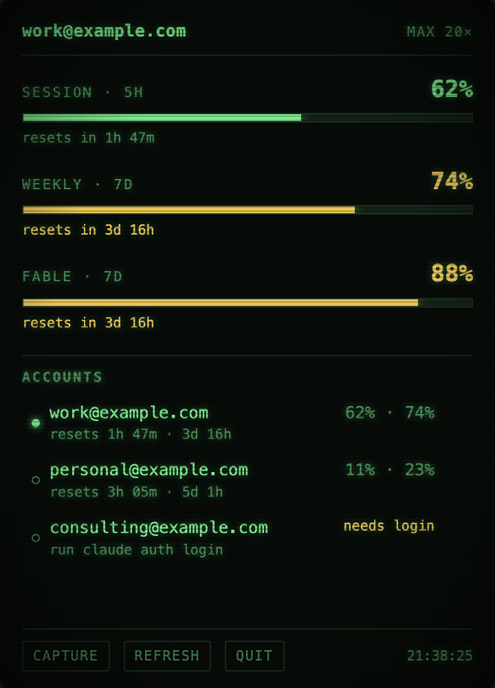
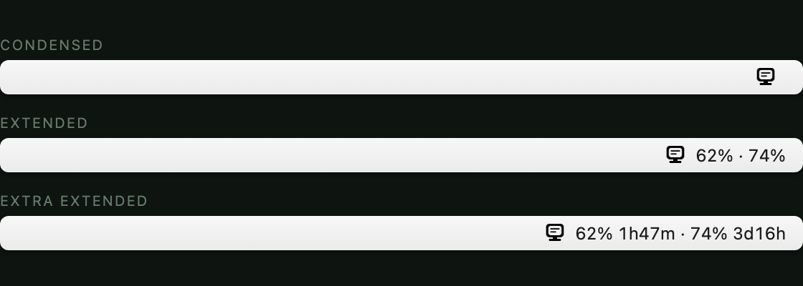

# vibemon

A macOS menu bar monitor for Claude Code usage limits — and a switcher for juggling several Claude
accounts.

Claude Code enforces a 5-hour session limit and a 7-day weekly limit, but the only way to see where
you stand is to type `/usage` inside a running session. vibemon puts those numbers in the menu bar,
watches every account you own — not just the one you are signed into — and swaps the active account
in a click.

<p align="center">
  
</p>

## What it does

- **Live gauges** for the 5-hour session window, the 7-day weekly window, and the per-model weekly
  limit when one is in play, each with its reset countdown.
- **Every account at once.** Parked accounts keep reporting usage in the background, so you know
  which one has room before you switch to it.
- **One-click switching.** The next Claude Code start picks up the new account.
- **Auto-rotation** (optional) moves you off an account that is nearly spent, and comes back to your
  preferred account once it recovers.
- **Re-auth warnings** when an account's refresh token dies.

### Menu bar

The label beside the icon has three densities, set from the tray menu:

<p align="center">
  
</p>

## Install

Requires macOS, Go 1.26+, and [just](https://github.com/casey/just). Claude Code must already be
installed and logged in.

```sh
git clone git@github.com:mxcd/vibemon.git
cd vibemon
just install      # builds and copies to ~/.local/bin
vibemon           # run the menu bar app
```

To start it at login:

```sh
just autostart    # installs a LaunchAgent; logs land in ~/Library/Logs/vibemon.log
just no-autostart # undo
```

## Getting your accounts in

vibemon never performs a login itself — it captures whatever Claude Code is already signed into.

```sh
claude auth login       # sign in as the account you want to add
vibemon capture         # or press Capture in the panel
```

Repeat per account. Then switch whenever you like:

```sh
vibemon list                    # * marks the active account
vibemon switch you@example.com
vibemon usage                   # usage for every stored account
vibemon remove you@example.com  # forget an account
vibemon token you@example.com   # print the account's headless token, for scripts
```

**Restart Claude Code after a switch.** Running sessions hold their token in memory and keep using
the old account until they exit; `vibemon switch` tells you how many are running. To carry on the
same conversation afterwards, `claude -c` continues where you left off.

## Several projects, several accounts: `vibemon exec`

Switching the global login is the wrong tool when you work on three projects at once with three
accounts. `vibemon exec` runs `claude` under a per-project account instead, without touching Claude
Code's own login and without a restart:

```sh
claude setup-token                    # once per account: a one-year, inference-only token
vibemon add-token you@example.com     # paste it; stored in the keychain vault next to the login

cd ~/github.com/org/repo
vibemon exec                          # interactive claude, under this project's first available account
vibemon exec -p "run the tests"       # headless turn, same account choice
vibemon pick                          # which account would run here, and why the others would not
```

Which accounts a project may use, and in which order, is set on the **Settings** page (tray menu
or the panel's Settings button): a default order, plus one ordered list per project path. The
longest matching path wins, so git worktrees under a project inherit its accounts. Order is
priority, not a pool: exec takes the first account that is neither benched by a limit nor over the
usage ceiling (90%, `--ceiling`), and moves down the list only when that one is out.

Headless (`-p`) runs get the runner logic that a 27-hour multi-agent build once had to reinvent in
bash:

- **Limit hit:** the account is benched until the reset time named in the message, and the same
  session is resumed under the next account (transcripts are local, so the work so far survives).
- **Per-model cap** ("You've reached your Fable limit"): same account, next model down
  (`--fallback fable,opus,sonnet,haiku`).
- **Missing transcript** ("No conversation found with session ID"): the id never got a transcript,
  so a fresh session restarts from the original prompt instead of retrying the resume.
- **Empty output:** a launch hiccup, retried on the same account five times.
- **Context exhausted** ("Prompt is too long"): terminal, exit 3, so a runner starts over with a
  compact brief instead of looping.
- **Locks:** one turn per session id and one per working directory at a time; a second `exec`
  queues behind the first. A crashed holder's lock evaporates with its process.
- Exit codes: 0 done, 1 failed, 2 no account has headroom (earliest return printed; `--wait`
  sleeps until then instead), 3 context exhausted. `--json` wraps the child's result with the
  account, model, session and every attempt.

Every turn lands in `~/Library/Application Support/vibemon/fleet.json`, so the panel shows how many
headless turns each account ran in the last hour and which ones a limit has benched. Auto-rotation
of the interactive login never moves onto an account the fleet has benched.

**What a setup-token cannot do.** Those tokens carry the `user:inference` scope only, so the usage
and profile endpoints answer 403. vibemon therefore identifies a token by the email you type, and
gets its usage numbers from the *login* you captured for the same email, polled by the menu bar app.
Capture the login too and exec skips spent accounts before they fail; without it, an account is
assumed fresh until a limit says otherwise. Interactive runs under a token lose the features Claude
Code ties to a full login (`/usage`, Claude in Chrome, Remote Control).

## Auto-rotation

Off by default — enable *Auto-switch when exhausted* in the tray menu. When the active account
crosses 95% on either window, vibemon moves to the account with the most headroom. Mark one account
as **Preferred** and vibemon will favour it whenever it has room, and return to it after rotating
away. Switching accounts by hand clears that intent until you rotate again.

Two honest limits: rotation only affects sessions started *after* it, so it cannot rescue a session
that is already blocked; and the 95% trigger is a constant in `gui.go` if you want to run closer to
the edge.

## How it works

Usage comes from `GET https://api.anthropic.com/api/oauth/usage`, the same endpoint `/usage` renders
from, authenticated with the OAuth token Claude Code already holds. Account identity comes from
`/api/oauth/profile`.

Accounts live in your login keychain under `vibemon-accounts`. Switching rewrites the `claudeAiOauth`
key inside Claude Code's own keychain item (`Claude Code-credentials`) and patches `oauthAccount` and
`userID` in `~/.claude.json`.

Properties this is careful about, because getting them wrong is silent and expensive:

- **MCP tokens are preserved.** That keychain item also holds every MCP server token you have
  authorised. Only the `claudeAiOauth` key is ever replaced; everything else passes through
  untouched, and a test asserts it.
- **Every keychain write is verified.** `security(1)` reports success even when it stored nothing
  useful, so each write is read back and compared before it counts.
- **The active account's token is never refreshed by vibemon.** Claude Code owns it; refreshing it
  from outside risks invalidating the session you are sitting in. Only parked accounts get refreshed.

The usage endpoint rate limits per account, so the active account is polled every 3 minutes and
parked ones every 20 — the countdowns tick locally in between. A failed fetch benches that account
with exponential backoff (2 minutes doubling to 30, or whatever `Retry-After` asks for) and the last
known numbers stay on screen. A 429 is never mistaken for a dead account.

Nothing leaves your machine except the two Anthropic API calls above. Preferences live in
`~/Library/Application Support/vibemon/prefs.json` and contain no secrets.

## Development

```sh
just check   # test + gofmt + vet
just run     # build and launch
just icon    # render the tray glyph and open it
```

The panel is a single `frontend/index.html` — markup, CSS and JS in one file, embedded with
`go:embed`. No npm, no build step. See `CLAUDE.md` for the rules around the credential paths.

The screenshots above are rendered from the real panel markup with sample data, so no account of
mine ends up in the repo.

## Caveats

- macOS only. Credential storage differs on Windows and Linux.
- Built against Claude Code 2.1.219. The usage endpoint and keychain layout are not public API and
  could change under you.
- Wails v3 is still alpha.

## License

MIT
